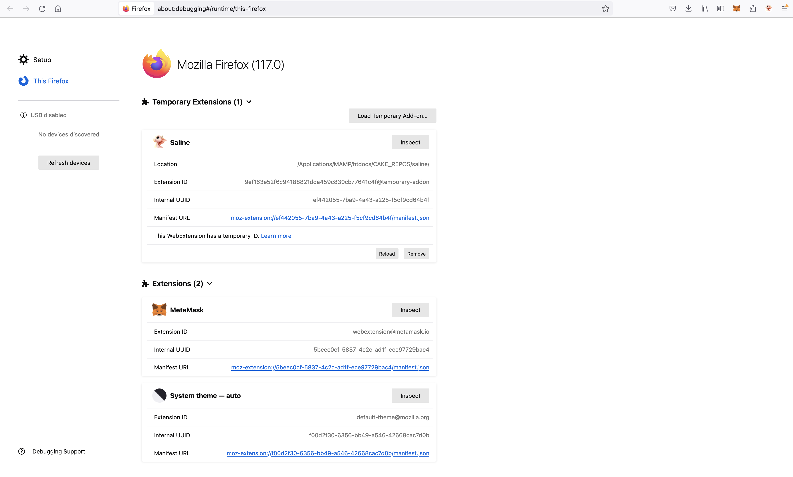

## SALINE

A browser extension wallet that supports Firefox and Chrome ...

Instructions for getting started with pre-alpha release:

* Download this repository locally in order to access vis Firefox or Chrome

If using Firefox, visit the following URL / page: `about:debugging#/runtime/this-firefox` :

If using Chrome, visit the following URL / page: `chrome://extensions/` :

